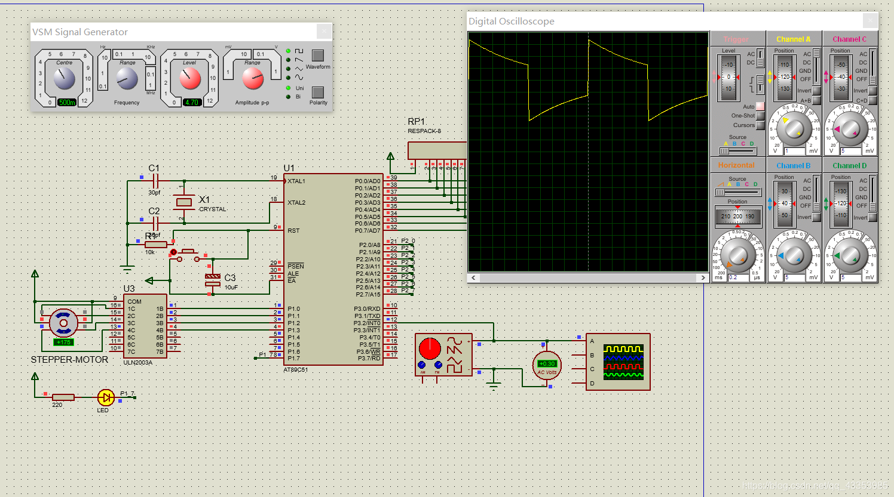
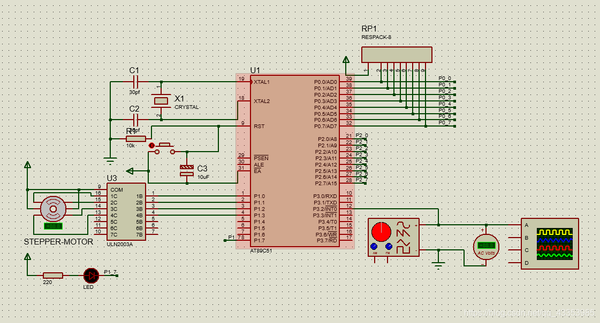

# 51驱动电机 

## 实验目的
掌握外部中断的打开方式；掌握步进电机的基本控制。  

## 实验目标 
设定外部信号发生器每2s钟，产生一个下降沿，作为外部中断源，中断处理完成led灯的闪烁一次，以及控制步进电机旋转一圈。

## 实验效果 

<br>
<div align=center>
</img>  
</div>
<br>

### proteus 工程
- #### 元器件:
  - 7SEG-MPX8-CC-BLUE 八位共阴极数码管
  - MOTOR-STEPPER 步进电机
  - ULN2003A 达林顿管
  - AT89C51 MCU
  - BUTTON 按键
  - CAP 电容
  - CAP-ELEC 电解电容
  - CRYSTAL 晶振
  - LED-BLUE 
  - RES 电阻

> 达林顿管又称复合管。他将两个 **`三极管`** 串联，以组成一只等效的新的三极管。这只等效三极管的放大倍数是原二者之积，因此它的特点是放大倍数非常高。达林顿管的作用一般是在高灵敏的放大电路中放大非常微小的信号，如大功率开关电路。在电子学电路设计中，达林顿接法常用于功率放大器和稳压电源中。  


51单片机的P0口做IO口使用时是漏极开路输出，其引脚一般需要在片外接一定阻值的上拉电阻，此时端口不存在高阻抗的悬浮状态，因此它是一个准双向口。同时，P0口每一位的驱动能力是P1~P3口的两倍，每位可以驱动8个LSTTL（Low-power Schottky TTL，即低功耗肖特基TTL）输入，89C51等单片机任何一个端口想要获得较大的驱动能力，必须采用低电平输出。  


<br>
<div align=center>
</img>  
</div>
<br>

## keil 工程

1. 按照要求，设定外部信号发生器每2s钟产生一个下降沿，即设置频率0.5HZ；
2. 步进电机是将脉冲信号转变为角位移或线位移的开环控制器件，非超载情况下，电机的转速停止的位置只取决于脉冲信号的频率和脉冲数，故它只有周期性的误差，而无累积误差；
3. 步进电机驱动芯片使用ULN2003A。此芯片是高耐压、大电流达林顿阵列产品，它由7个NPN达林顿管组成。ULN2003A具有电流增益高、工作电压高、温度范围宽、带负载能力强等特点其输入5V的电平输出可达50mA/50V。  

主函数
```c
#include <reg52.h>
#include <intrins.h>
#define uchar unsigned char
#define uint unsigned int
#define MotorPort P1
uchar code FFW[]={0x01,0x03,0x02,0x06,0x04,0x0c,0x08,0x09};//正转
sbit LED=P1^7;
/*---函数声明---*/
void Init();
void SETP_MOTOR_FFW(uchar n);
void SETP_MOTOR_REV(uchar n);
void DelayMS(uint ms);
/*--------------*/
void main(void)
{
	Init();
	while(1)
	{
		/*要做的任务*/
	}
}

```

定时器初始化及中断子函数:
```c
void Init()
{
	EA=1;
	EX0=1;	//外部中断0开
	IT0=1;  //边沿触发
	LED=1;	//灭灯
}
/*外部中断0子程序,对应端口P3^2*/
void ISR_Key(void) interrupt 0 using 1
{
	SETP_MOTOR_FFW(1);
}

```

 电机驱动及延时函数:
```c
void SETP_MOTOR_FFW(uchar n)
{
 	uchar i,j,temp;
	LED=~LED;
	for(i=0;i<5*n;i++)
	{
	 	for(j=0;j<8;j++)
		{
			MotorPort = FFW[j];
			for(temp=0;temp<25;temp++)
			{
				DelayMS(1);
			}
		}
	}
	LED=~LED;
}
void DelayMS(uint ms)
{
 	uchar i;
	while(ms--)
	{
	 	for(i=0;i<120;i++);
	}
}
```