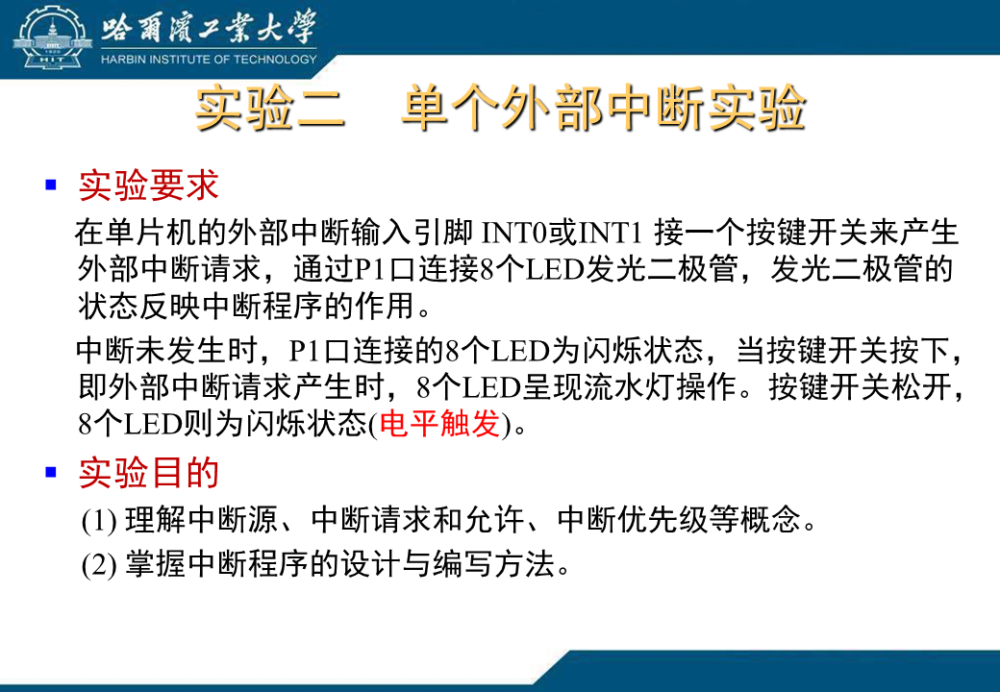
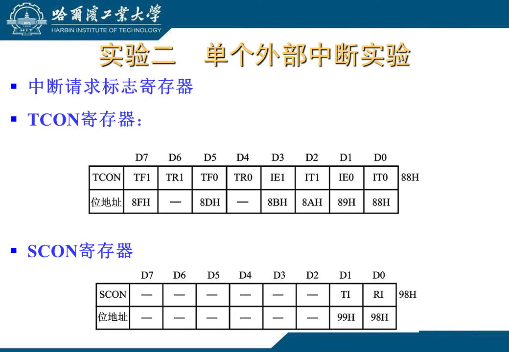
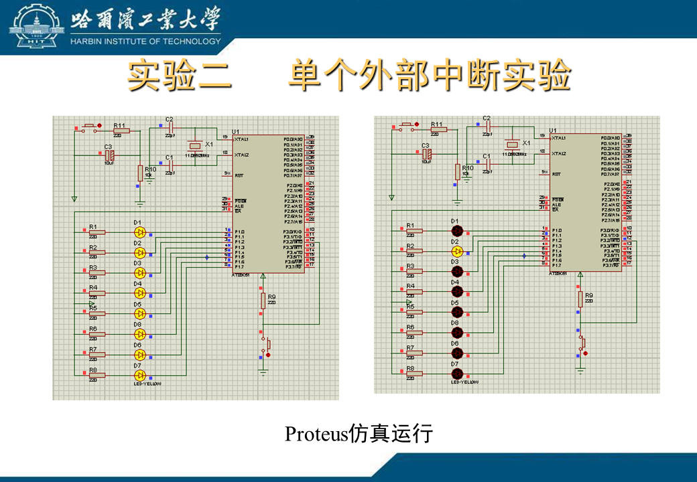
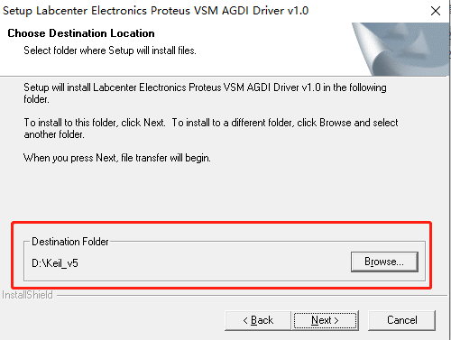
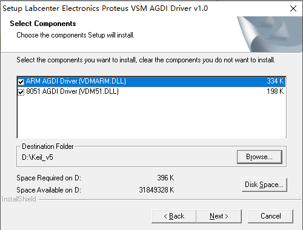
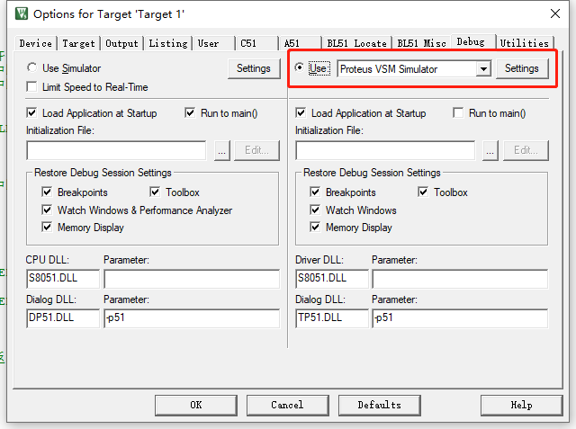
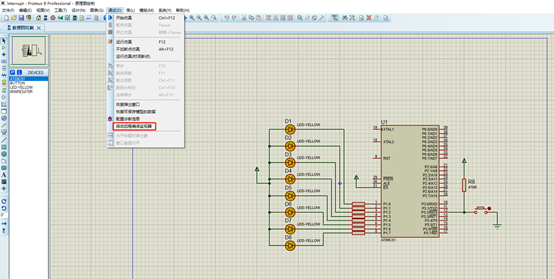
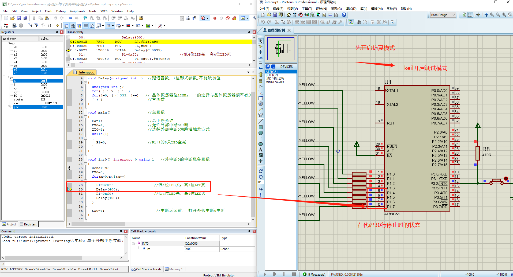
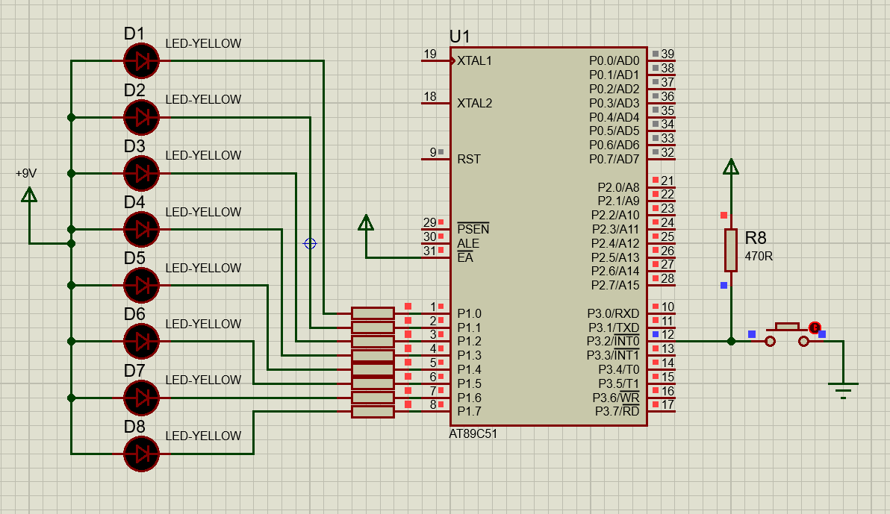

## 单个外部中断实验

### 实验介绍
<br>
<div align=center>
</img>  
</div>
<br>

<br>
<div align=center>
</img>  
</div>
<br>

<br>
<div align=center>
</img>  
</div>
<br>

<br>
<div align=center>
<span>proteus效果图</span><br>
</img>  
</div>
<br>

### keil与proteus联合调试
需要安装vdmagdi.exe，安装包是[vdmagdi-exe.zip](./res\files\vdmagdi-exe.zip)  


vdmagdi 安装
<br>
<div align=center>
</img>  
</div>
<br>

<br>
<div align=center>
</img>  
</div>
<br>

<br>
<div align=center>
<span> 在debug页面选择proteus调试器</span><br>
</img>  
</div>
<br>

<br>
<div align=center>
<span> proteus 调试->启用远程编译监听器</span><br>
</img>  
</div>
<br>

<br>
<div align=center>
<span> 中断触发时，P1高低4位的状态</span><br>
</img>  
<span> 蓝的代表低电平、红的是高电平、灰色是不确定电平、黄色的代表短路</span><br>
</div>
<br>
<br>


### proteus 工程
元器件:  
- Vcc电源
- AT89C51
- LED-YELLOW
- MINRES470R
- BUTTON (按键)

<br>
<br>
原理图如下:  
<br>
<div align=center>
</img>  
</div>
<br>
<br>

现在的问题是LED灯不亮，在debug模式测量一下LED的电流和电压，由于电阻过大，电流很小，灯没有亮，增加电压值即可。

<br>
<br>


### keil 工程

源码 
<br>
<br>

```c
#include <reg51.h>
#define uchar unsigned char

void Delay(unsigned int i)  //延迟函数, i位形式参数,不能赋初值
{
	unsigned int j;
	for( ; i > 0; i--)
	for(j=0; j < 333; j--)   // 晶体振荡器位12MHz， j的选择与晶体振荡器频率有关
	{ ; }                     //空函数
}

void main()                 //主函数
{
	EA=1;                     //总中断允许
	EX0=1;                    //允许外部中断0中断
	IT0=1;                    //选择外部中断0为跳沿触发方式
	while(1)
	{
		P1=0;                   //P1口的8只LED全亮
	}
}

void int0() interrupt 0 using 1   //外中断0的中断服务函数
{
	uchar m;
	EX0=0;
	for(m=0;m<5;m++)
	{
		P1=0x0f;                   //低4位LED关，高4位LED亮
		Delay(400);
		P1=0xf0;                   //低4位LED亮，高4位LED灭
		Delay(400);
	}
	
	EX0=1;                        //中断返回前， 打开外部中断0中断  
}

```
