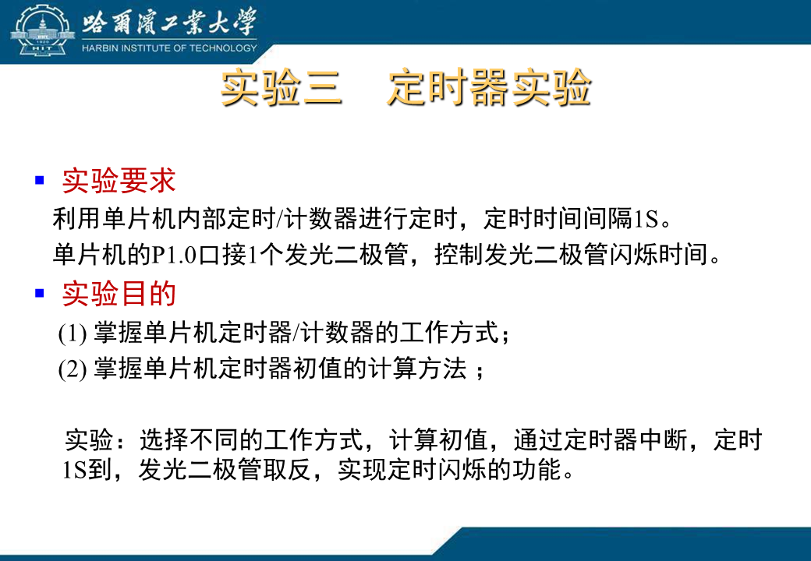
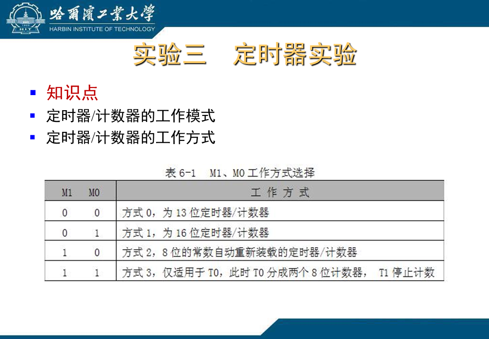
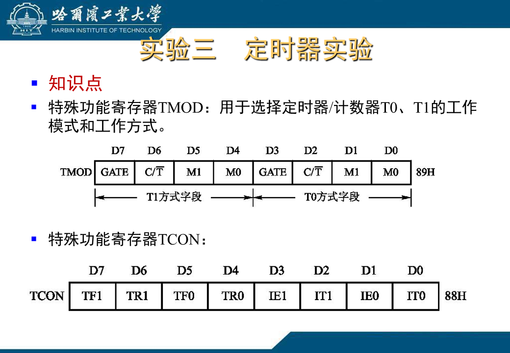
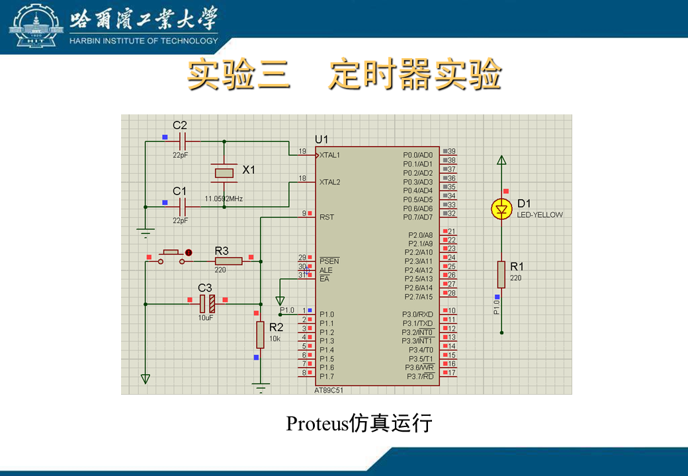
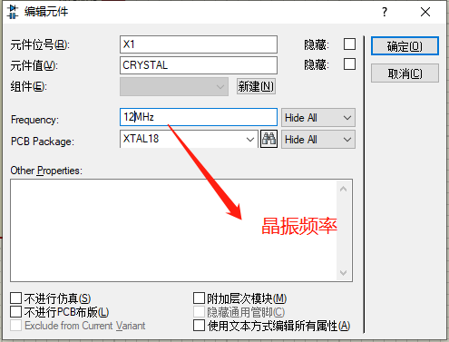
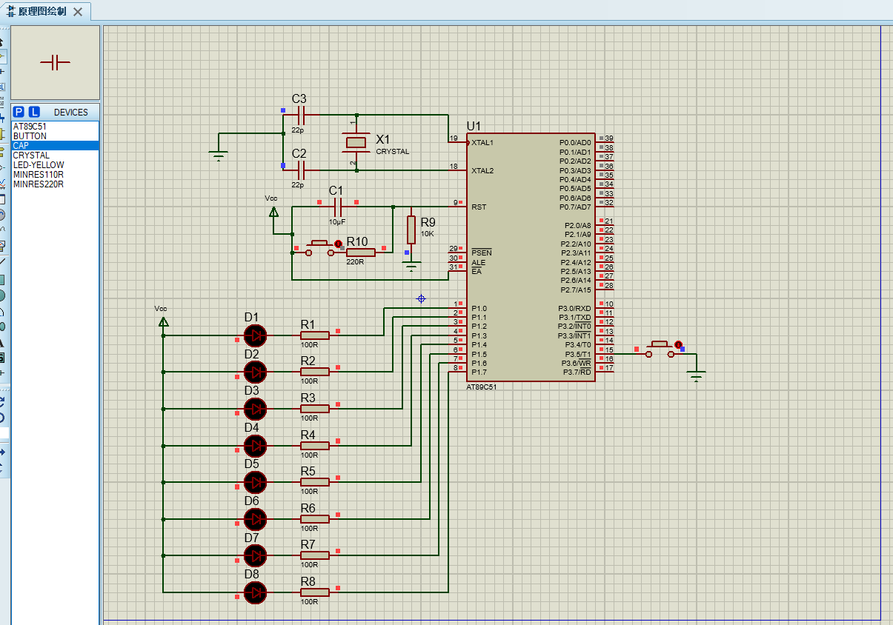

## 定时器实验

### 实验介绍
<br>
<div align=center>
</img>  
</div>
<br>

<br>
<div align=center>
</img>  
</div>
<br>

<br>
<div align=center>
</img>  
</div>
<br>

<br>
<div align=center>
</img>  
</div>
<br>

### proteus 工程
元器件:
- Vcc电源
- Cap (电容)
- AT89C51
- Button 
- LED
- RES电阻
- CRYSTAL (晶振)

<br>
<br>
<div align=center>
<span>晶振器件频率设置</span><br>
</img>  
</div>
<br>

> 延迟时间计算:  
> 首先是时钟周期的算法：时钟周期（T）=1（秒）/晶振频率。  
> （比如：上面代码的时钟周期为1/12M（秒））。
> 这是单片机的基本时间单位。是由晶振震荡出来的，也叫震荡周期。  
> 其次是机器周期：机器周期是由时钟周期组成的，机器周期是单片机完成一个基本操作所需要的时间。  
> 1 传统的8051单片机：  
> 它的1个机器周期是由12个时钟周期组成的。
> 以12M晶振举例，它的一个机器周期就是：12（个时钟周期）*1（秒）/12MHz = 1（us)  
> 最后是指令周期：这个是单片机执行一条指令所需要的时间，它是由机器周期组成的。

<br>

原理图如下: 
<br>
<div align=center>
</img>  
</div>
<br>

### keil 工程
源码如下
<br>
<br>

```
#include <reg51.h>

void Delay(unsigned int i)  //延迟函数, i位形式参数,不能赋初值
{
	unsigned int j;
	for( ; i > 0; i--)
	for(j=0; j < 125; j--)   // 晶体振荡器位12MHz， j的选择与晶体振荡器频率有关
	{ ; }                     //空函数
}

void main()                 //主函数
{
	TMOD=0x50;                //设置计时器T1的方式1计数
	TH1=0xFF;                 //向TH1写入初值的高8位
	TL1=0xFC;                 //向TL1写入初值的低8位
	EA=1;                   //总中断允许
	ET1=1;                    //定时器T1中断允许
	TR1=1;                    //启动定时器T1
	
	while(1);                 //等待计数中断
}

void T1_int() interrupt 3   //T1中断函数
{
	for(;;)
	{
		P1=0xff;                //8位LED全灭
		Delay(500);
		P1=0;                   //8位LED全亮
		Delay(500);
	}
}
```