基于Keil+Proteus流水灯实验,适合零基础的同学。**项目代码在流水灯文件夹下**, 也可以先参照
[视频讲解](https://www.bilibili.com/video/BV1dv411h7vL?from=search&seid=6190284922334573491&spm_id_from=333.337.0.0)  

效果展示 :japanese_goblin:  
</img>

#### Proteus流水灯工程
  
<br>
<div align=center>
<span>新建工程，填写工程名</span><br>
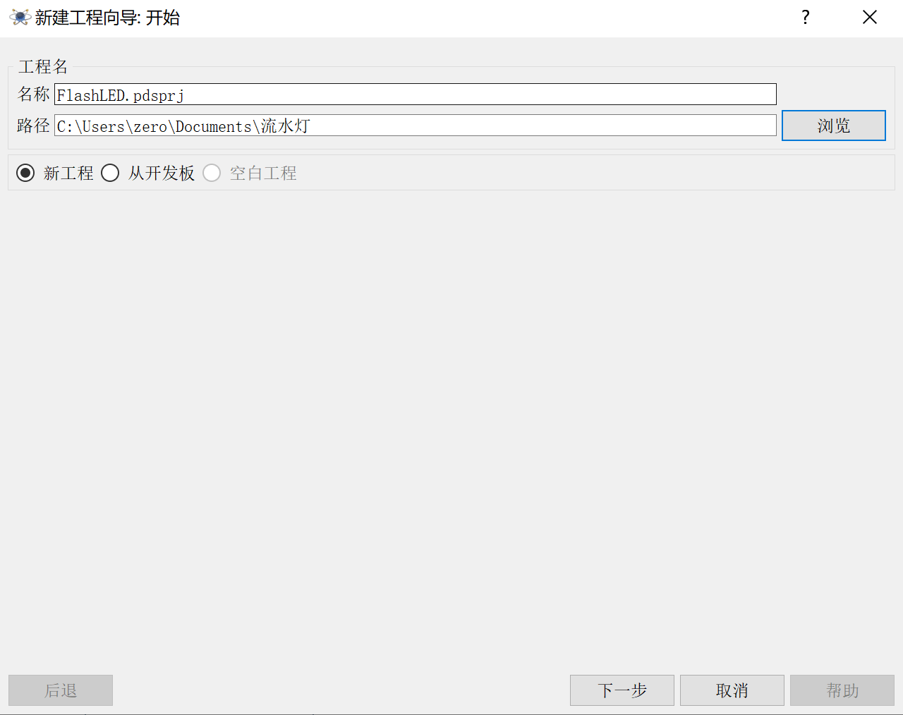</img>  
</div>
<br>

<br>
<div align=center>
<span>选择从模板中创建原理图,其他选择默认选项，直到工程创建完毕!</span><br>
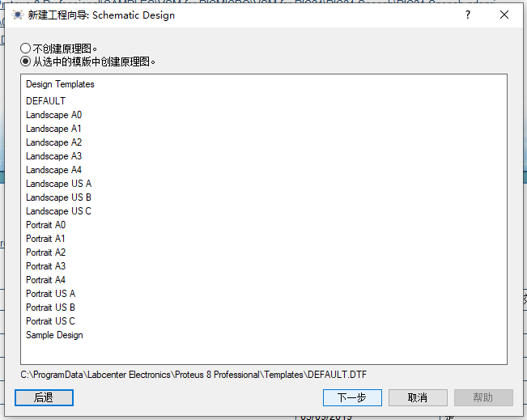</img>  
</div>
<br>

<br>
<div align=center>
<span>工程总结截图</span><br>
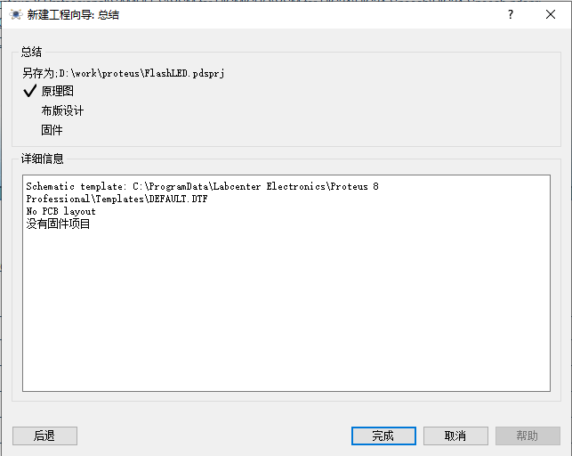</img>  
</div>
<br>


选择元器件(Pick图标),双击选中:
* AT89C51
* LED 
* 220R 电阻
  
单片机选择  
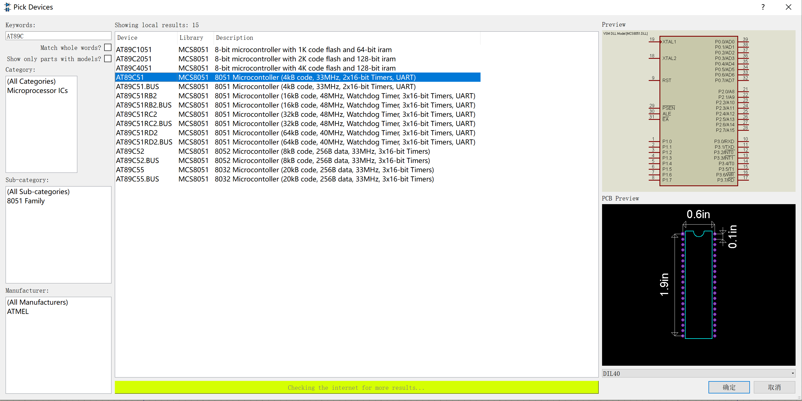</img>  
<br>
LED选择黄色  
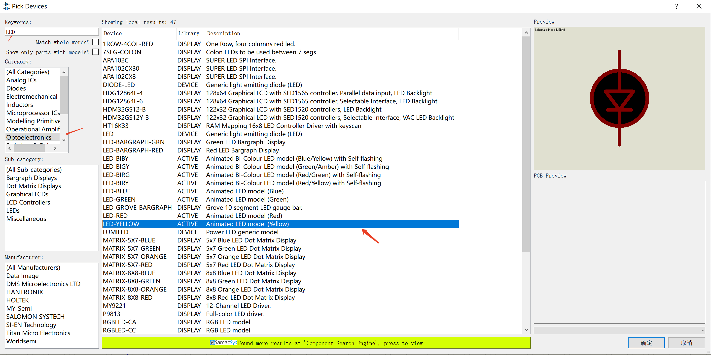</img>  
<br>
选择220R的电阻, 220R -> Resistors -> MINRES220R  
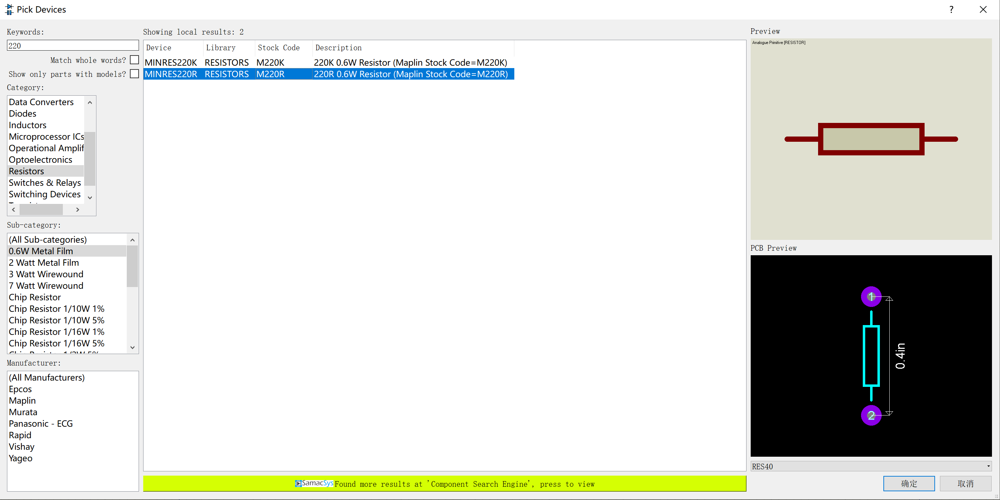</img>

* 接下来就开始设置布局:
  
1. 把元器件放到布局中，可以进行旋转、设置文本(右击编辑属性)，进行连线。等到电阻与LED连接一组后，选中组，使用块复制，复制8组。
2. 在侧边栏选择“总线模式”,连接总线，需要转弯的地方，先单击停止，再按住Ctrl连接目标点。把单片机的P0与LED都连接到总线上。
3. 在侧边栏选择终端模式>>POWER,放置电源,把电阻的一端连接到电源正极，电流的流向如下:
   > 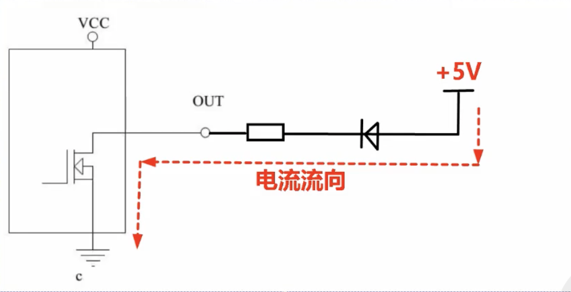</img>
4. 使用属性赋值工具给线编号. 字符串为: NET=# 。这个#计数器,把起始值设置为1，增值设为1。设置完P0的标号，重置起始值为1，设置LED线标号.(使用总线模式时，一定要给线标号，不然不知道连接关系,灯也不会亮的!)
   > 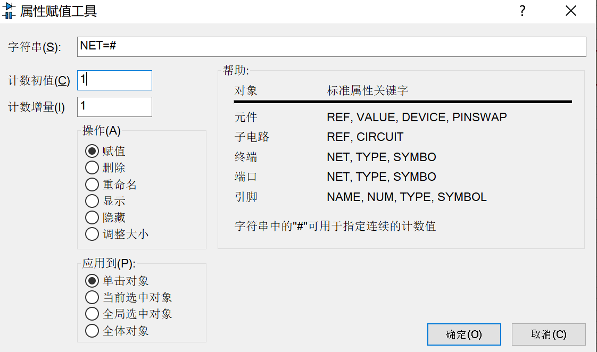</img>

仿真电路图  
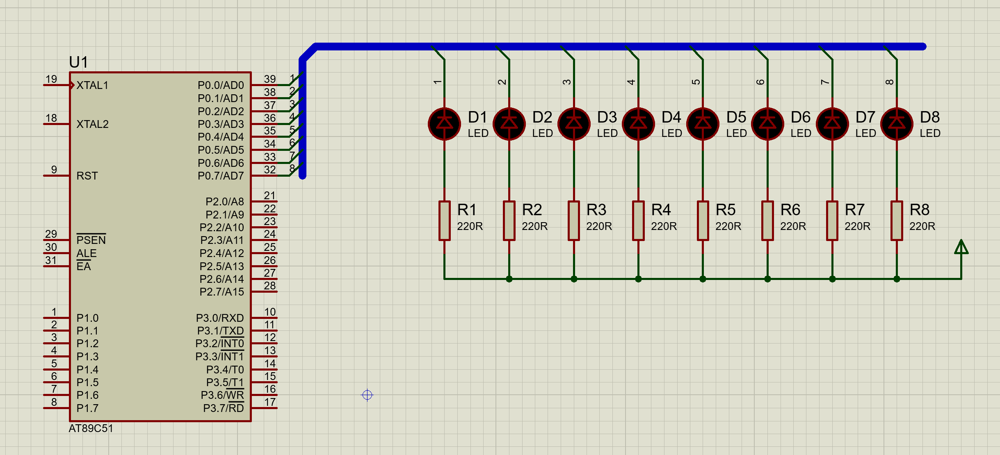</img>
#### Keil流水灯工程  
首选创建工程  
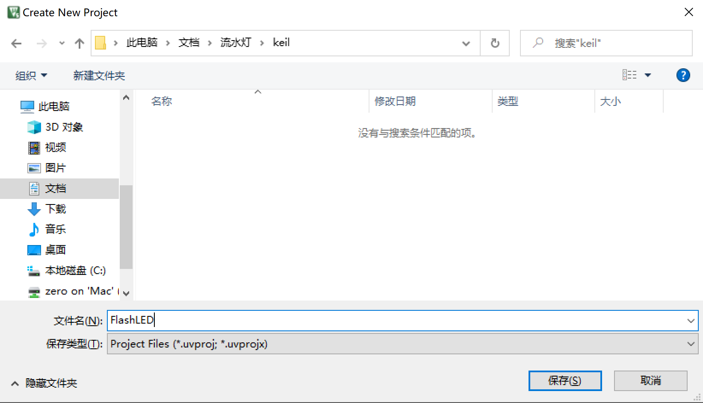</img>

接下来都是默认选项，完成界面时，选择单片机
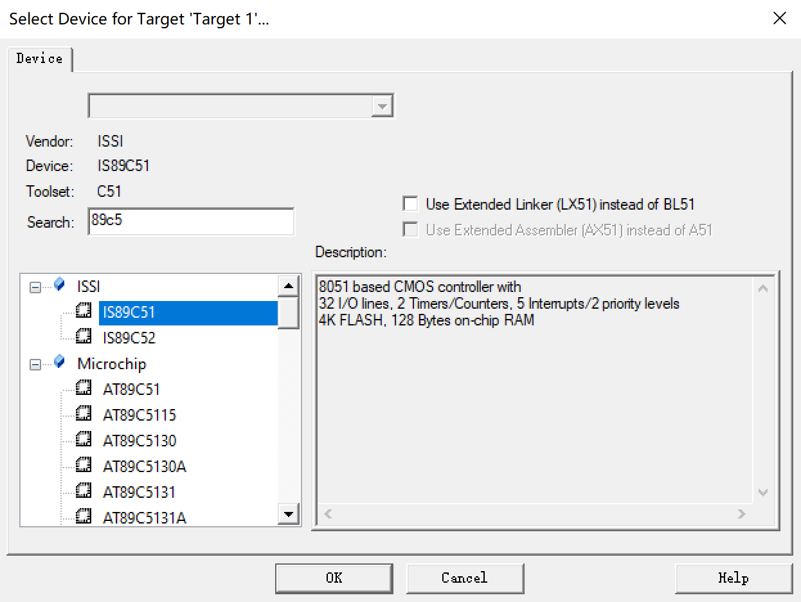</img>

选择No，不拷贝  
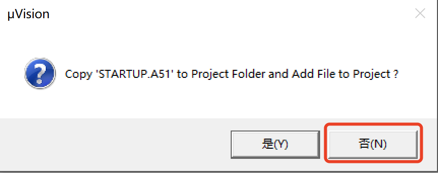</img>

创建文件并保存为.c,并设置输出文件为hex  

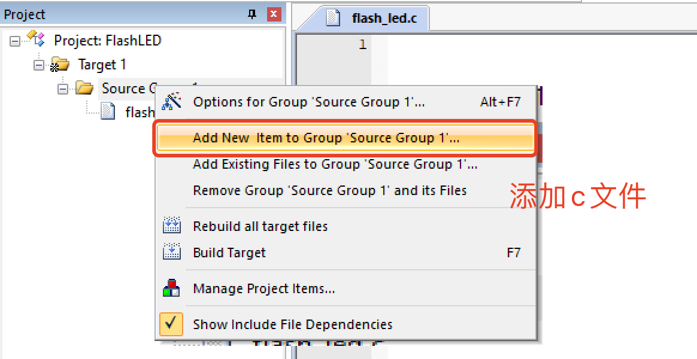</img>
  
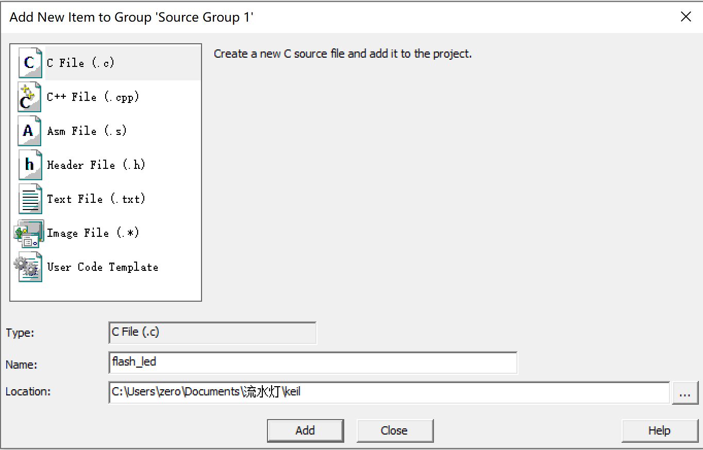</img>
  
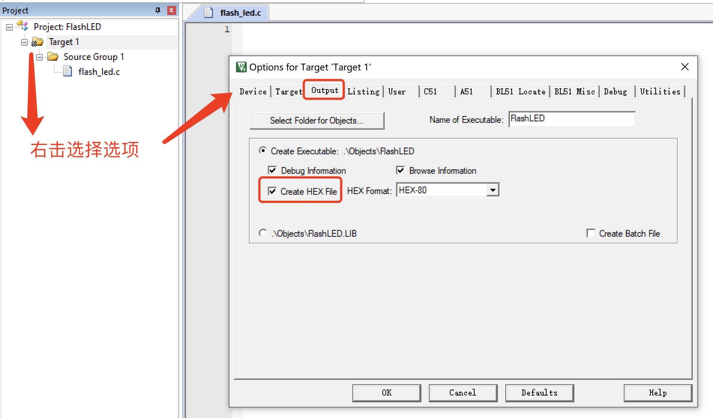</img>


flash_led.c 代码文件  
```c
#include<reg51.h>
#include<intrins.h>

//延迟函数
void DelayMS(unsigned int x)
{
	unsigned char i;
	while(x--)
		for(i=0; i < 120; i++); //晶振为12Mhz
}

int main()
{
	P0 = 0xFE;
	while(1)
	{
		DelayMS(250);
		P0 = _crol_(P0, 1); //循环左移
	}
}
```
<br>
选择Project->Build Target(F7) 编译项目。二进制文件在工程目录的Objects/FlashLED.hex  
  
<br>
<br>
把编译好FlashLED.hex导入到proteus程序中. 双击单片机元器件，在"编辑元器件"界面导入hex文件.  
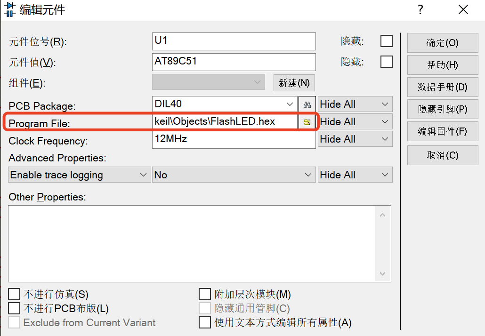</img>

<br>
最终点击右下角的"运行仿真"图标就能看到效果了。
<br>

***
  
Tips:  
  
Keil查看单片机参数,这里晶振的评率为40,一般为12Mhz  
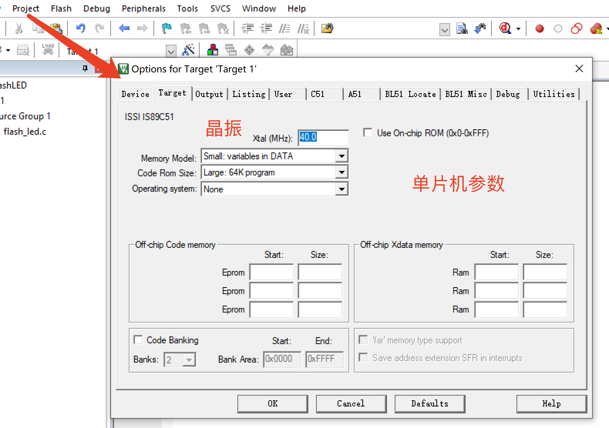</img>
  
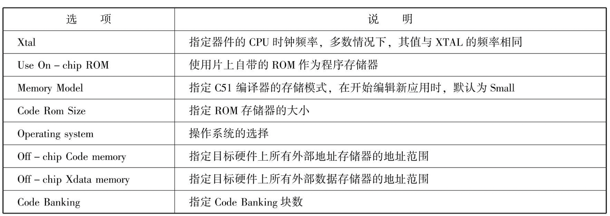</img>
  
Keil中文注释乱码问题  
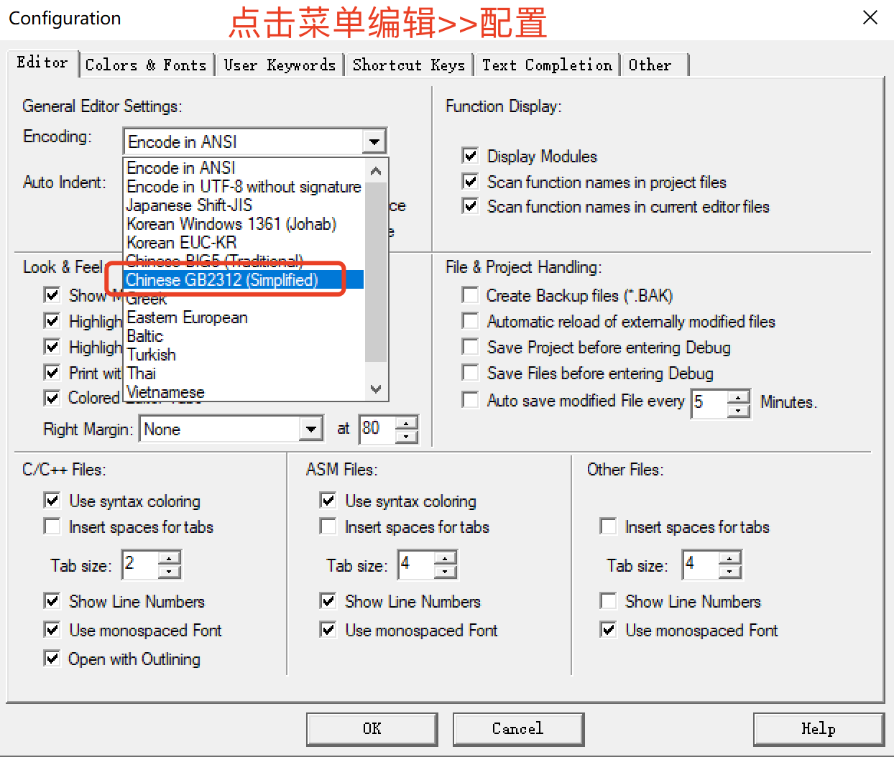</img>
  
Proteus中颜色点  
> 在仿真图中,不同颜色的点所代表的意思: 红点--高电平 蓝点--低电平 黄点--短路 箭头--交流电瞬时电流方向